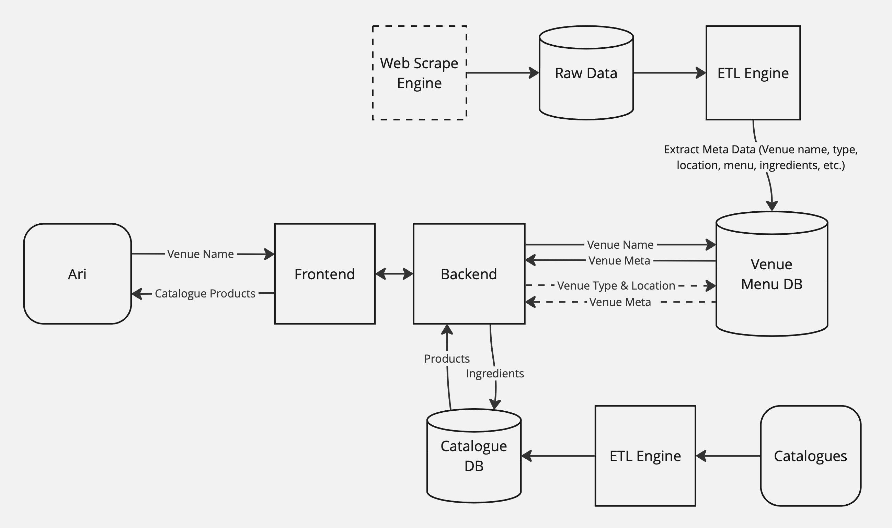

# Product-Recommender

This is a system that reads menus and extracts key ingredients, and matches them to relevant products from a PDF catalogue. This helps Ari, a sales rep, receive tailored product suggestions when entering a venue's name, improving his sales effectiveness. The solution leverages Python for data scraping, parsing, and integration with external sources to provide personalized recommendations. 

Currently supports the venues below:
* Deli Ziosa
* Joe's Sandwich Bar
* Luna Lu
* Restaurant Hubert
* Wintergarden Deli

# Workflow


* First, process venue menus and catalogues and save them in the database for later search.
* Second, the backend uses the venue's name to retrieve venue data, then uses the ingredients found in the menu to find products in the catalogue. The Gemini model gives suggestions based on the menu data and products retrieved.
* Dotted line is for future improvements.

# Run the code
Set up Apache Solr
1. Download Solr 9.x from https://solr.apache.org/downloads.html and decompress 
2. In the solr-9.x.0 folder run 
```
bin/solr start -c
```
3. Open http://localhost:8983/solr/ and create `venue_menu` and `catalogues` collections with the default schema
4. Put your venue raw data in the `/data/venue_raw_data` folder and your catalogues in the `catalogue_data` folder. Then go in the ETL folder and run
```
bash process_all.sh
```

Set up backend service
```
uvicorn main:app
```

Set up frontend service
```
npm start
```

# Future improvments
* Implement web scraping with richer detail: Expand the web scraping functionality to capture more comprehensive data for each venue, such as the address, location coordinates, and additional metadata like menu items, featured cuisines, and venue ratings.
* Enhance product suggestions: Integrate data from other similar venues to improve product recommendations by finding related products based on venue meta and customer preferences.
* Improve user experience: Display images of products or show the original catalogue page in the response to give Ari more context and a visual aid when making suggestions.
* Support real-time updates: Incorporate periodic scraping or API integrations to ensure that venue menus and catalogue items remain up-to-date without manual intervention.